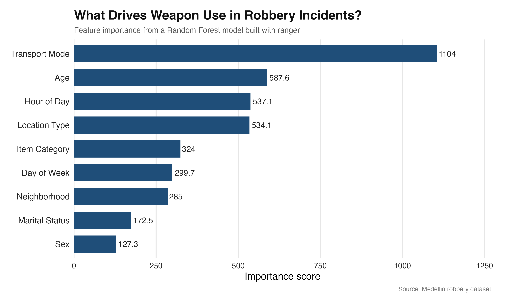

# Predicting Weapon Use in Robbery Incidents in Medellín, Colombia

This project applies a supervised machine learning workflow in R to model whether a reported robbery incident involves a weapon.

The goal is to evaluate how well contextual, temporal, and demographic variables predict weapon involvement, and to identify which features contribute most to predictive performance.

---

## Project Motivation

Urban crime varies not only in frequency but also in severity. One important dimension of severity is whether a weapon is involved, which has direct implications for victim risk, policing strategy, and public safety. While many analyses focus on crime counts or rates, this project instead examines within-incident variation, specifically what factors are associated with weapon use during a robbery.

From a machine learning perspective, the objective is to assess whether observable features such as time, location, and victim context contain predictive signal for weapon involvement. The emphasis is on predictive performance and pattern detection rather than causal interpretation.

---

## Data

The analysis uses publicly available, incident-level robbery data from Medellín.

Each observation represents a reported robbery event and includes:

- **Incident timestamp** (used to extract hour and day of week)
- **Victim characteristics** (age, sex, marital status)
- **Contextual features** (transport mode, location type, neighborhood)
- **Item category** (type of good stolen)
- **Weapon indicator** (used to construct binary outcome)

> **Note:** The dataset reflects reported incidents and may be subject to reporting bias.

---

## Methods

**Outcome:**

- Binary indicator of weapon involvement (`weapon_used`: Yes / No)

**Model:**

- Random Forest (ranger implementation)

**Predictors:**

- Hour of day
- Day of week
- Age
- Sex
- Marital status
- Transport mode
- Neighborhood (grouped)
- Location type (grouped)
- Item category

**Preprocessing:**

- Duplicate incidents removed using time–location keys
- Missing values handled via:

  * Median imputation (numeric variables)
  * “Unknown” category (categorical variables)
- High-cardinality categorical variables reduced using feature grouping
- Factor levels aligned across training and test sets

**Validation Strategy:**

- Random train/test split

  * Train: 80%
  * Test: 20%

**Evaluation Metrics:**

- Accuracy
- Recall by class (weapon vs. non-weapon)

---

## Key Results

The model achieves approximately **80% accuracy** on held-out test data.

- Recall (weapon cases): ~71%  
- Recall (non-weapon cases): ~86%  

## Feature Importance

The figure below shows the relative importance of each feature in the trained model:

Feature importance analysis from the random forest model indicates that:

- **Transport mode** is the strongest predictor of weapon involvement  
- **Time of day** and **location type** contribute significantly  
- **Neighborhood-level variation** is present but less dominant after grouping  
- **Age** has moderate predictive value relative to other demographic variables  

These results suggest that **situational and contextual factors** are more informative than static demographic characteristics in predicting weapon use.

---

## Notes

* This project focuses on predictive modeling and pattern identification
* It does not claim a causal relationship between predictors and weapon use
* Results should be interpreted as associations within observed data
* The model is not intended for real-time or operational crime prediction

---
